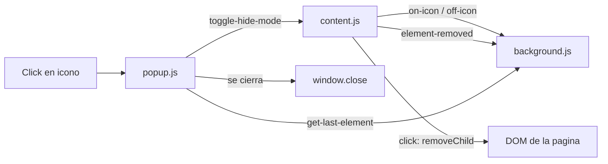

# Ocultar Elementos - Extensión de Chrome

Extensión de Chrome (Manifest V3) para quitar elementos del DOM de la página activa. Los commits son de diegolijo. Rama `main`, al día con `origin/main`. Último commit: **27 nov 2024** (`ocultar popup`). Cambio sin commitear: versión `1.0` → `1.1` en `manifest.json`.

## Instalación

1. Clona o descarga este repositorio en tu ordenador.
2. Abre Google Chrome y dirígete a `chrome://extensions/`.
3. Activa el "Modo de desarrollador" en la esquina superior derecha.
4. Haz clic en "Cargar sin empaquetar" y selecciona la carpeta donde se encuentra este proyecto.
5. La extensión debería aparecer ahora en tu lista de extensiones de Chrome.

## Qué hace hoy

1. El usuario pulsa el icono de la extensión.
2. `popup.js` abre el popup, a los 1 ms manda `toggle-hide-mode` a la pestaña activa y se cierra solo (`window.close()`).
3. `content.js` alterna el modo ocultar:
   - Activo: clase `hide-cursor` en `body` (cursor `not-allowed`), quita la clase `is-not-login`, fuerza `overflow: auto`, y pide al background el icono "on".
   - Inactivo: quita el cursor y vuelve al icono normal.
4. Con el modo activo, al pasar el ratón el elemento se pinta de rojo (`#FF0000AA`) y al salir se restaura el fondo.
5. Al hacer clic (fase de captura) se hace `preventDefault` + `stopPropagation`, se borra el nodo con `removeChild` y se manda su `outerHTML` al service worker. Si `removeChild` falla, el fallback es `display: none !important`.
6. `background.js` guarda ese HTML en memoria y cambia el icono entre `icons/icon128.png` y `icons/on_icon128.png`.

## Archivos

- `manifest.json`: MV3, nombre "Ocultar Elementos", permisos `activeTab` y `scripting`, content script en `<all_urls>`, service worker, popup.
- `content.js`: modo ocultar, highlight, borrado del nodo.
- `background.js`: icono y último HTML eliminado (solo en memoria del service worker).
- `popup.html` y `popup.js`: sin botón visible. El título y el texto "tag Destroy" están comentados. El popup se cierra al instante.
- `style.css`: una sola regla, `.hide-cursor { cursor: not-allowed !important; }`.
- `icons/`: tres juegos (normal, on, off) en 16, 48 y 128. En el manifest los tres tamaños apuntan al PNG de 128.

## Historial (oct–nov 2024)

- `init` — arranque.
- Cursor crosshair, todavía sin iconos.
- README.
- `overflow: auto` en el body al activar el modo.
- Iconos y borrado real del nodo (`removeChild`) en vez de solo ocultarlo.
- Cambio de icono desde el background, iconos on/off, manejo de errores del popup.
- El popup muestra el HTML del último elemento eliminado.
- Highlight rojo del elemento bajo el cursor.
- Popup oculto: se comentó "tag Destroy" y el cierre pasó de 100 ms a 1 ms.

## El README original ya no coincidía con el código

Hasta esta actualización, el README describía otra versión:

- Decía que había un botón en el popup. El popup no tiene botón: abrir el icono ya alterna el modo.
- Decía que el modo dura un solo clic y luego se apaga. El clic no desactiva el modo; hay que volver a pulsar el icono.
- Decía cursor `crosshair`. El CSS usa `not-allowed`.
- Decía que el elemento se oculta con `display: none`. El camino normal es `removeChild`; `display: none` solo es el catch.

## Cosas a medias o muertas

- `cursorOptions` y `currentCursorIndex` en `content.js` no se usan.
- `#hideButton` está estilado en el popup y no existe en el HTML.
- Los PNG `off_icon*` no se referencian; el estado off usa `icon128.png`.
- `chrome.scripting` está en permisos y no hay ninguna llamada a esa API.
- El HTML del último elemento se pide en el popup, pero el popup se cierra a 1 ms, así que casi no se ve.
- Ese HTML vive en una variable del service worker: si Chrome duerme el worker, se pierde.
- Quitar `is-not-login` y forzar `overflow: auto` parece un parche para una web concreta, no un comportamiento general.
- El README dejaba los iconos como TODO; los archivos ya están.
- Versión `1.1` solo en el working tree, sin commit.

## Contribuciones

Si tienes ideas para mejorar esta extensión o encuentras problemas, por favor crea un issue o envía un pull request.

## Licencia

Este proyecto está bajo la Licencia MIT. Puedes hacer lo que quieras con él, solo recuerda dar crédito al autor original. No hay archivo `LICENSE` en el repositorio.
